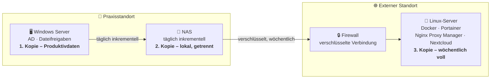

# IT-Infrastruktur mit cloudbasiertem 3-2-1-Backup für eine Zahnarztpraxis

> IHK-Abschlussprüfung · Fachinformatiker/-in Systemintegration · Sommerprüfung 2026


Aufbau einer neuen IT-Infrastruktur (Windows Server, Active Directory, Dateifreigaben) inklusive einer redundanten, verschlüsselten **3-2-1-Backup-Strategie** für besonders schutzwürdige Patientendaten.

## Inhalt

- [Ausgangslage & Auftrag](#ausgangslage--auftrag)
- [Ziele](#ziele)
- [Zielarchitektur](#zielarchitektur)
- [Eingesetzte Technologien](#eingesetzte-technologien)
- [Repository-Struktur](#repository-struktur)
- [Vorgehensweise](#vorgehensweise)
- [Datenschutz](#datenschutz)
- [Projektstatus](#projektstatus)

## Configuration
- [Linux](Linux)
- [NPM]()
- [Docker](Docker)

## Ausgangslage & Auftrag

Der Kunde eröffnet eine neue Zahnarztpraxis mit mehreren Behandlungszimmern. Es existiert aktuell **keine eigene IT-Infrastruktur**: kein zentraler Server, keine strukturierte Benutzer- und Rechteverwaltung, keine zentrale Dateiablage und kein Datensicherungskonzept.

Da die Praxis von Beginn an mit besonders schutzwürdigen Patientendaten arbeitet, besteht der Auftrag darin, eine vollständige IT-Infrastruktur neu aufzubauen und direkt mit einer zuverlässigen, revisionssicheren und DSGVO-konformen Datensicherung nach dem **3-2-1-Prinzip** zu versehen.

## Ziele

- **3 Kopien** der Daten — Produktivdaten plus zwei Backups
- **2 unterschiedliche Speicherorte** — lokales NAS am Praxisstandort und ein externer Server
- **1 externe Kopie** — schützt auch bei Brand, Diebstahl oder Totalausfall vor Ort
- Automatisierte Sicherung: **täglich inkrementell**, **wöchentlich voll**
- Verschlüsselung **in transit und at rest** gemäß Art. 9 DSGVO (Gesundheitsdaten)
- Nachweis der Wiederherstellbarkeit durch einen dokumentierten **Restore-Test**

## Zielarchitektur

Grobskizze der drei Datenkopien und ihrer Speicherorte. Der Windows Server bildet die Produktivumgebung, das NAS die lokale Zweitkopie, der externe Linux-Server die dritte, ausgelagerte Kopie.



## Eingesetzte Technologien

| Komponente | Rolle im Projekt |
|---|---|
| **Windows Server** | Active Directory, zentrale Benutzer-/Rechteverwaltung, Dateifreigaben (1. Kopie) |
| **NAS** | Lokale zweite Kopie, tägliches inkrementelles Backup |
| **Linux (Ubuntu)** | Betriebssystem des externen Servers für die dritte Kopie |
| **Docker / Portainer** | Containerverwaltung auf dem externen Server |
| **Nextcloud** | Ziel-System für die externe, dritte Backup-Kopie |
| **Nginx Proxy Manager** | Verschlüsselte, reverse-proxied Anbindung an Nextcloud (TLS) |
| **Firewall** | Absicherung der Verbindung zwischen Praxisstandort und externem Standort |

## Repository-Struktur

Jeder Ordner enthält die Konfiguration bzw. Dokumentation der jeweiligen Komponente aus der Zielarchitektur oben.

```
Docker/                 # Compose-Dateien & Container-Konfiguration
Firewall/                # Regelwerk und Konfiguration der Standortabsicherung
Linux/                   # Setup & Härtung des externen Ubuntu-Servers
Nextcloud/                # Installation & Konfiguration (3. Kopie)
Nginx Proxy Manager/      # Reverse-Proxy- & TLS-Konfiguration
Portainer/                # Container-Verwaltungs-UI für den Linux-Server
Windows Server/            # AD-, GPO- & Dateifreigabe-Konfiguration
doc/                      # Projektantrag, Dokumentation, Netzplan
```

## Vorgehensweise

1. **Planung** — Ist-Analyse, Zielarchitektur, Auswahl der Backup-Lösung, Wirtschaftlichkeitsanalyse
2. **Aufbau Praxisstandort** — Windows Server, Active Directory, Dateifreigaben, NAS-Konfiguration
3. **Aufbau externer Standort** — Linux-Server, Docker/Portainer, Nextcloud, Nginx Proxy Manager
4. **Absicherung** — Firewall-Regeln, verschlüsselte Standortverbindung
5. **Automatisierung** — tägliche inkrementelle und wöchentliche Voll-Backups
6. **Test** — Restore-Test, Funktions- und Sicherheitstest

## Datenschutz

> [!IMPORTANT]
> Da im späteren Produktivbetrieb echte, besonders schutzwürdige Patientendaten verarbeitet werden, wird dieses Projekt nicht beim Kunden vor Ort, sondern vollständig in einer **virtuellen Testumgebung mit ausschließlich anonymisierten Beispieldaten** umgesetzt und dokumentiert.

## Projektstatus

- [x] Ist-Analyse & Zielarchitektur geplant
- [ ] Aufbau Windows Server & Active Directory
- [ ] Aufbau externer Nextcloud-Server
- [ ] Restore-Test & Dokumentation

---

*Projektarbeit · Fachinformatiker/-in Systemintegration · IHK München und Oberbayern*
